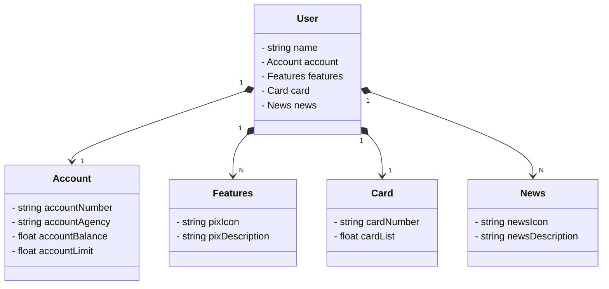

Tela Inicial Santander utilizando Java, RESTFull API e Spring Boot.

## Diagrama de Classe

## Tecnologias

# 1. Criação e Versionamento de API
- Spring Boot 3, Java 17, Gradle, PostgreSQL, H2 Database 
    
    **Spring Web** Para construir a API REST. 
    **Spring Data JPA** Para persistência de dados. 
    **H2 Database** Para desenvolvimento local. 
    **PostgreSQL** Para produção.. 

# 2. Abstração e Modelagem do Domínio
- Figma, JSON Editor, Mermaid 

# 3. Implementação do Back-End
- Spring Boot, Java 17, JPA  
Criação de classes de domínio, como User, Account, Card, Feature, e News, utilizando anotações JPA para mapear as tabelas no banco de dados. 
Conexão com o banco de dados H2 para testes locais. 
Configuração do banco de dados no arquivo application.yml. 

# 4. Implementação de Camada de Negócio (Service e Implements)
- Spring Service   
Criação de interfaces de serviços e implementação das mesmas com lógica de CRUD. 
A injeção de dependências foi realizada por meio do Spring Framework.

# 5. Endpoints REST (Controller)
- Spring MVC   
Implementação de controladores REST, incluindo os métodos GET e POST para manipulação de dados de usuários.

# 6. Criação de Testes com Swagger
- Swagger, SpringDoc  
Integração do Swagger para testar a API diretamente pela interface web, facilitando a visualização e consumo dos endpoints.

# 7. Tratamento de Exceções
- Spring Exception Handling  
Descrição: Criação de uma classe global de tratamento de exceções, centralizando os erros como IllegalArgumentException, NoSuchElementException, e erros inesperados.

