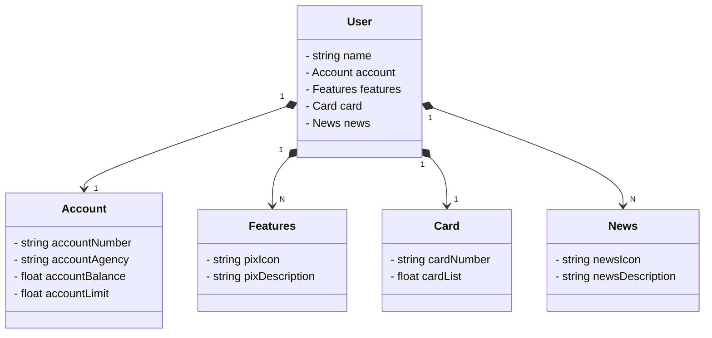

Tela Inicial Santander utilizando Java, RESTFull API e Spring Boot.

## Diagrama de Classe

```mermaid
classDiagram
    class User {
        - string name
        - Account account
        - Features features
        - Card card
        - News news
    }

    class Account {
        - string accountNumber
        - string accountAgency
        - float accountBalance
        - float accountLimit
    }

    class Features {
        - string pixIcon
        - string pixDescription
    }

    class Card {
        - string cardNumber
        - float cardList
    }

    class News {
        - string newsIcon
        - string newsDescription
    }

    User "1" *--> "1" Account
    User "1" *--> "N" Features
    User "1" *--> "1" Card
    User "1" *--> "N" News

```
